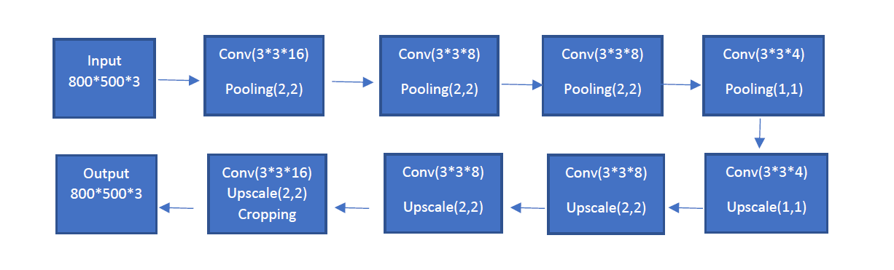

# Class-Attendance-Tool--Face-Recognition
Built the tool to automate the process of class attendance. The tool successfully worked in camera mode for class of 30 and in image mode for class of 10.  

# Building Class Attendance Tool with Face Recognition of students
Ankur Porwal, Jingxi Li

# Objective:
Taking attendance of students can take around 5-10 minutes daily of the class. Therefore, automating
the process and recording daily information in a database can not only save instructor’s time and effort
but also will help in maintaining attendance information in more useful manner to perform different
analysis.

Our goal is to take real-time input or pictures of the class and develop a face recognition system that
identifies the present students thus helps in taking attendance.
This project mainly allows user to do face recognition on two modes which support different
functionalities:
1. Camera mode (Online method)
2. Image mode (Offline method)
Both the camera mode and the image mode allow users to do face recognition based on current dataset
and to input new users’ faces into the existing dataset. The camera mode is implemented for real-time
face recognition and the image mode is implemented for situations when the user cannot show up in
front of the camera. However, if there is not enough number of images in the dataset, the camera mode
may outperform the image mode. The detailed instruction can be found in Readme.

# Approach:
While using the tool, the user needs to provide the input type to perform either of below tasks:
1. Enter a new user’s face
2. Perform face recognition on existing users

Both of these tasks are can be performed for camera and image mode.

1. Enter a new user’s face

In this way, embedding for new user will be generated and recorded in file maintained in JSON format.
Face detection and
alignment by MTCNN
Open Data dictionary file
and update new user’s coordinates
Face features by FaceNet
in 128 / 512-Dimensional
vector

2. Perform face recognition on existing users

The first two tasks are same as getting input. For all the faces detected, its features are generated using
FaceNet and these embedding are used to calculate distance.

Steps:

Step 1: Face Detection

MTCNN uses three convolutional networks (RNet, ONet, PNet) to detect faces on both live camera and
image. It outputs the bounding boxes to mark the face and generates facial landmarks to be used as
input to do face alignment. There are three stages to be done in face detection with MTCNN.
In stage one, images/live camera inputs are passed in to the program which automatically creates
multiple scaled copies of the image. The copies are then fed into P-Net which is the first convolutional
network in MTCNN. At the end of stage one, P-Net outputs bounding boxes with high confidence after
removing highly overlapped boxes.
In stage two, out-of-bound bounding boxes are padded and all the bounding boxes resulting from P-Net
are passed to the second convolutional network (R-Net). Again, bounding boxes with low confidence are
deleted and Non-Maximum Suppression is employed to remove highly overlapped bounding boxes.
Stage three is similar to stage two, except that stage three has a more complicated convolutional
network (O-Net) whose output is more precise.

Step 2: Face Alignment

Align the face in a way that it is as closely centered as possible using landmarks from MTCNN in step 1.
In this step, we create a class to do face alignment after getting landmarks from MTCNN. The average
positions of face points are extracted from Dlib open source code which is commonly used aspect ratio
for 5 landmarks. This class is called when doing face recognition and inputting face features into the
database for both camera mode and picture mode.

Step 3: Face Feature generation

Pre-trained models of FaceNet are used to generate Embedding in 128-Dimensional/512-Dimensional
vector for each transformed image as the face feature. We tried three different model weights including
one 128D and two 512D pre-trained weights. The two 512D weights are generated using FaceNet
Inception Resnet V1 architecture on CASIA-WebFace and VGGFace2 training dataset. Details for the
Face detection and
alignment by MTCNN
Calculate distance from existing user and
report closest user or unknown if
distance is higher than threshold
Face features by FaceNet
in 128 / 512-Dimensional
vector
128D model weights are missing, we only know it is trained on the FaceNet Inception Resnet V1
architecture.
The CASIA-WebFace dataset consists of 453 453 images over 10 575 identities after face detection.
According to the author of the models, the best performing model has been trained on the VGGFace2
dataset consisting of ~3.3M faces and ~9000 classes. Therefore, we implement all three pretrained
weights for camera mode, but only implement weights trained on VGGFace2 for image mode.

Step 4: Face Feature comparison

Use camera mode/image mode to compare the face features with all face features existed in the dataset
storing as a dictionary to find if there is a match or not. If there is a match, then the name will be
presented; and if not, “Unknown” will be presented.

# Autoencoder:
Moreover, since the image mode is not working as well as the camera mode, we also used autoencoder
the generate extra images for the program to raise the accuracy.
The Autoencoder is trained on UTKFace dataset with following architecture.
The link to dataset: https://susanqq.github.io/UTKFace/
First all input are resized for shape 800 * 500 * 3 to have same dimension and output is saved to create
deformed images.

Architecture:

# Building Blocks:

1. MTCNN
Multi-task Cascaded Convolutional Networks (MTCNN) is used for face detection and alignment in the
project. MTCNN applies a cascaded structure of deep convolutional networks with three stages and is
able to achieve both face detection and alignment with multi-task learning where stochastic gradient
descent is used for training CNNs in the networks.

Stages:

i) P -Net
ii) R -Net
iii) O -Net

The first stage is a fully convolutional network (P-Net) to quickly produce candidate windows and their
bounding box regression vectors which are used for adjusting the windows. Multiple scaled copies of the
image are taken as input of P-Net. Then, non-maximum suppression (NMS) is applied to combine highly
overlapped candidate windows by deleting candidate windows that have high overlap with the most
confident candidates. The idea is capture small face in bigger windows and big face in small windows
with fixed kernel size.
The second stage is a more complicated CNN (R-Net) which takes all the coordinates of candidate
windows from P-Net as input to refine the candidate windows by using the bounding box regression and
NMS.
The last stage, which takes the result from R-Net as input, is to use an even more complicated CNN (ONet)
to refine the candidate windows and generate facial landmarks positions.
Loss Functions:
Loss function minimized in training includes three parts: face/non-face classification, bounding box
regression and facial landmark localization.

Face classification: 𝐿𝑖
𝑑𝑒𝑡 = −(𝑦𝑖
𝑑𝑒𝑡 log(𝑝𝑖 ) + (1 − 𝑦𝑖
𝑑𝑒𝑡 )(1 − log(𝑝𝑖 ))) where 𝑝𝑖 is the probability of
recognizing 𝑥𝑖 as face, and 𝑦𝑖 is the label for 𝑥𝑖.
Bounding box regression: 𝐿𝑖
𝑏𝑜𝑥 = ||𝑦̂𝑖
𝑏𝑜𝑥 − 𝑦𝑖
𝑏𝑜𝑥 ||2
2
Facial landmark localization: 𝐿𝑖
𝑙𝑎𝑛𝑑𝑚𝑎𝑟𝑘 = ||𝑦̂𝑖
𝑙𝑎𝑛𝑑𝑚𝑎𝑟𝑘 − 𝑦𝑖
𝑙𝑎𝑛𝑑𝑚𝑎𝑟𝑘||2
2
Combined loss function: 𝑚𝑖𝑛 Σ Σ 𝛼𝑗𝛽𝑖
𝑗𝐿𝑖
𝑗
𝑗∈{𝑑𝑒𝑡,𝑏𝑜𝑥,𝑙𝑎𝑛𝑑𝑚𝑎𝑟𝑘}
𝑁𝑖
=1 where N is the number of training
examples and 𝛼𝑗 indicates the importance of the task.

Reference:
https://www.lao-wang.com/wp-content/uploads/2017/07/1604.02878.pdf

# 2. FaceNet

Reference: https://arxiv.org/pdf/1503.03832.pdf

As a one-shot learning problem, face recognition is usually done using so called Siamese network which
indicates running the identical CNN on two different inputs and comparing the results.
FaceNet, introduced in 2015 by Google, uses a deep convolutional network to learn a Euclidean
embedding for each face whose similarity is measured by the L2 distance in the embedding space. A
triplet-based loss function is trained for the 128-D embedding representing the face feature. Capturing
the similarities between faces, the 128-D embedding can be used for clustering faces. In other word, L2
distance in the embedding space will be closer for similar faces than for non-similar faces.
Triplet Loss:
Triplet Loss is a loss function where three types of inputs exist: anchor, positive and negative. While
training, Triplet Loss minimizes the distance between a positive and an anchor and maximizes the
distance between an anchor and a negative. Motivated by the nearest-neighbor classification, Triplet
Loss want to ensure that an anchor face (𝑥𝑖
𝑎) is closer to all positive faces (𝑥𝑖
𝑝) than to any of the
negative faces (𝑥𝑖
𝑛) with the constraint below for all set of triplets in the training dataset.
||𝑓(𝑥𝑖
𝑎 ) − 𝑓(𝑥𝑖
𝑝)||2
2 +  < ||𝑓(𝑥𝑖
𝑎 ) − 𝑓(𝑥𝑖
𝑛)||2
2
where  is a margin that is enforced between positive and negative pairs.
Therefore, the loss is L = Σ [||𝑓(𝑥𝑖
𝑎 ) − 𝑓(𝑥𝑖
𝑝)||2
2 − ||𝑓(𝑥𝑖
𝑎 ) − 𝑓(𝑥𝑖
𝑛)||2
2 + 𝛼]+
𝑁𝑖

Inception Network:

The original paper experiments on five different network architectures and tests the performance for
each of them. The performance is shown in the picture below.
We chose pre-trained weights on NN2 model architecture which is the inception network because of the
highest performance among all the model architectures tested by the authors.
Based on GoogLeNet style Inception models which have 20  fewer parameters (6.6M – 7.5M), FaceNet
Inception model is almost the same as the one discussed in the paper Going deeper with convolutions.

# Conclusion:

The camera mode is working very well if face is trained by moving your it in different directions, model is
able to capture face features efficiently. Faces are tested by putting on glasses, going far from camera,
hiding part of face with hands etc.
Performance of image mode is highly dependent on variety of images provided in training. It also
requires face to be in centering, left and right facing to work. Although, there is a good improvement in
performance by image rotation and generating Autoencoder transformed images, there is scope for
improvement in image mode.
